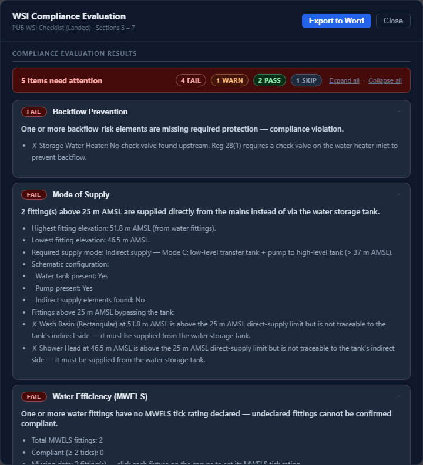
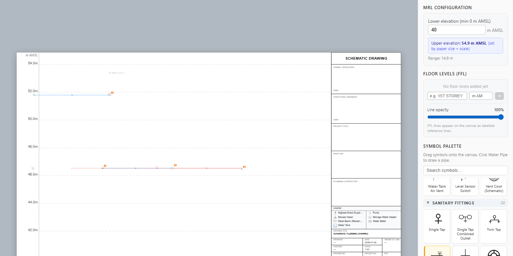
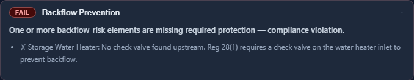
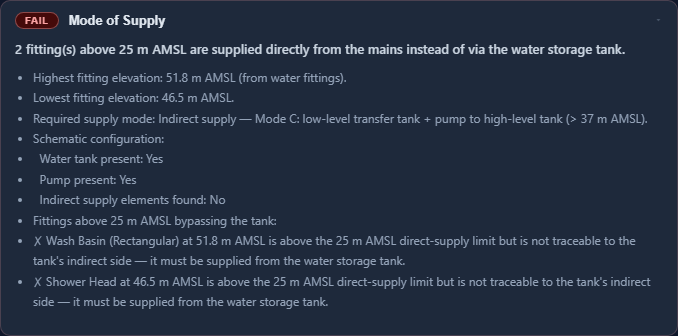
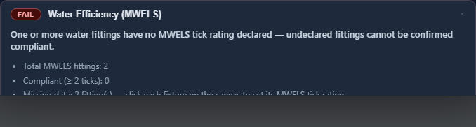

# Schematic Drawing Portal

A web application for designing water pipe schematics and running deterministic compliance evaluations against Singapore's PUB Water Supply (Internal) requirements — SS 636, Regulation 28, and the PUB Handbook 2022.



---

## What it does

**Stage 1 — Draw:** Design water pipe schematics on a real-world elevation (mAMSL) canvas using drag-and-drop symbols, on a proper CAD-style sheet (paper size + drawing scale, title block, PDF tracing-background import). Export structured JSON metadata or a vector PDF diagram.

**Stage 2 — Evaluate:** Run the live canvas through 8 deterministic compliance checks covering backflow prevention, supply mode, water efficiency, tank/pump sizing, hot water contamination, and pipe materials. Export a Word (.docx) report listing every non-compliant item with a cropped image of its location.

There is **no LLM/AI layer** anywhere in this codebase — every check is a rule-based graph/BFS traversal over the schematic's topology, written in plain Python. An earlier chat-style "Evaluate tab" backed by an LLM summary and a RAG knowledge base existed early in the project and was removed as redundant/unused; nothing in the current app calls out to a model.

---

## Key Features

| Feature | Description |
|---|---|
| Drawing Canvas | Drag-and-drop schematic editor with 70 built-in water system symbols, snapping pipe/port connectivity, undo/redo, copy-paste, rubber-band multi-select |
| Real-world Elevation (mAMSL) | Y-axis maps to metres Above Mean Sea Level; lower bound is user-set, upper bound is derived from the sheet's paper size × drawing scale; optional labelled Floor Level (FFL) reference lines |
| Sheet & Title Block | Paper size / drawing scale setup, an editable title block, PDF import as a tracing background |
| 8 Compliance Checks | Reg 28 backflow, mode of supply, MWELS water efficiency, tank/pump installation, long bath, hot water contamination, pipe materials, Highest Direct Supply Fitting marker — see [Compliance Checks](#compliance-checks) below |
| Pipe Styling | Per-type and per-pipe colour, hot pipes always dashed, AutoCAD-style crossing "jump" arcs, freeform diameter labels (e.g. "20mm") |
| Highest Direct Supply Fitting Marker | Standalone symbol that records a user-declared elevation for the highest fitting on direct supply, so a PE reviewer can read it straight off the drawing |
| Templates | Pre-built schematic snippets, insertable at the current viewport |
| Export | Structured JSON metadata, vector PDF diagram, Word (.docx) non-compliance report with cropped element images |
| No LLM / No RAG | All compliance logic is deterministic Python — nothing here calls out to a model |

---

## Screenshots

### Drawing Canvas


### Compliance Evaluation Report


### REG28 — Backflow Prevention


### SEC221 — Mode of Supply


### SEC721 — Water Efficiency (MWELS)


### Highest Direct Supply Fitting Marker


---

## Quick Start (local development)

### Prerequisites
- Node.js + npm
- Python 3.12 with a virtualenv at `backend/.venv` (or any venv — see below)

### 1. Clone the repo

```bash
git clone https://github.com/jh-sudo/drawing-portal.git
cd drawing-portal
```

### 2. Install dependencies

```bash
cd frontend && npm install && cd ..
cd backend && python -m venv .venv
source .venv/Scripts/activate   # or .venv/bin/activate on macOS/Linux
pip install -r requirements.txt
cd ..
```

### 3. Run both dev servers

```bash
./start.sh
# Backend:  http://localhost:8000  (logs: backend.log)
# Frontend: http://localhost:5173  (logs: frontend.log, proxies /api to the backend — see vite.config.ts)
# API docs (Swagger): http://localhost:8000/docs
./stop.sh   # when done
```

`start.sh` runs uvicorn without `--reload` by default. If this repo lives in a OneDrive-synced folder, OneDrive's background file-touching can make `--reload`'s file-watcher spawn duplicate worker processes without killing the old ones — restart with `./stop.sh && ./start.sh` after a backend change instead. Set `BACKEND_RELOAD=1` to opt back into `--reload` if the repo isn't in a synced folder.

There's also an agent-facing Playwright driver for scripting the canvas (drawing pipes, placing symbols, running the evaluation flow, screenshotting) under `.claude/skills/run-schematic-drawing-portal/` — see that skill's `SKILL.md`.

---

## Environment Variables

### Backend (`backend/.env`, optional — gitignored, not committed)

| Variable | Default | Description |
|---|---|---|
| `SLACK_FEEDBACK_WEBHOOK_URL` | *(unset)* | Slack Incoming Webhook for real-time early-tester feedback notifications. Feedback is also always printed to stdout regardless, since the Airbase container filesystem isn't writable. |
| `SYMBOLS_PATH` | `<backend>/symbols` | Path to the symbols directory (SVG library + `manifest.json`) |

None of these need to be set for local development — every one has a working default.

### Frontend (build-time)

| Variable | Default | Description |
|---|---|---|
| `VITE_API_BASE_URL` | *(unset — uses the Vite dev proxy)* | Backend API base URL for **production builds only**. Don't set this in dev — `vite.config.ts` already proxies `/api/*` to `http://localhost:8000`, and setting it manually bypasses (and can mask problems with) that proxy. |

---

## Stage 1: Drawing Canvas

### Sheet & Elevation Configuration
- **Sheet Setup** sets the paper size and drawing scale — the canvas's upper mAMSL bound is derived from this (`paper height × drawing scale`), not set directly
- **Lower elevation** is user-set (minimum 0 m AMSL)
- **Floor Levels (FFL)** — add named reference lines (e.g. "1ST STOREY") at a given elevation; they render as solid black lines separate from the dashed mAMSL grid

### Placing Symbols
- Drag any symbol from the palette onto the canvas, or tap/click to select then tap the canvas
- Click a placed symbol to select it; drag to reposition; right-click for context options
- Flip-only symbols (pump, water tank, water heaters, water meter, tap point) prompt for a Left→Right / Left←Right orientation on placement
- Tee junctions and elbow bends prompt for which port is the inlet

### Drawing Pipes
1. Click a pipe tool (Cold/Hot Water Pipe) in the palette to activate pipe drawing mode
2. Click on canvas to set the start point, click again to complete the segment
3. Pipes chain automatically; press **Escape** to exit pipe mode
4. Select a pipe to set its colour or a freeform diameter label (e.g. "20mm") from the Pipe panels — hot pipes always render dashed, cold/generic pipes always solid

### Export
- **Export Metadata (JSON)** — structured JSON with all symbol positions, mAMSL elevations, pipe segments, and sheet config. See [example exports](docs/examples/) and [Metadata Export Format](#metadata-export-format) below.
- **Export Diagram (PDF)** — a vector PDF of the sheet, including the title block and diameter labels.

---

## Stage 2: Compliance Evaluation

### How to use
1. Draw your schematic in the Draw tab
2. Click **Evaluate Schematic**
3. Complete the pre-evaluation acknowledgment checklist (only items relevant to what's on your schematic are shown; most are auto-verified and non-blocking)
4. Review the report, or click **Export to Word** for a `.docx` listing every FAIL/WARN item with a cropped image of its location

Evaluation runs on the live canvas state — no separate export/attach step.

### Compliance Checks

| Check | Reference | What it verifies |
|---|---|---|
| Backflow Prevention (REG28) | Reg 28(1), SS 636 §6.4/6.5 | Every backflow-risk element (water heater, bidet, listed appliances) has a check valve / vacuum breaker upstream, found via BFS topology search |
| Mode of Supply (SEC221) | Handbook 2.2.1 | Supply mode matches the highest fitting's elevation: ≤25 m direct, ≤37 m indirect (tank), >37 m Mode C (transfer tank + pump) |
| Water Efficiency (SEC721 / MWELS) | Handbook 7.2.1 | Every water fitting with an MWELS table carries a declared tick rating meeting the minimum (an undeclared rating fails, same as a rating below the minimum) |
| Tank & Pump Installation | SS 636 | Overflow/warning/outlet dimensions, effective capacity vs. occupancy demand, pump head, bypass line topology |
| Long Bath | SS 636 | Capacity ≤250 L needs no provisions; >250 L requires an acknowledgment (TMV, recirculation, 40 mm overflow) |
| Hot Water / Contamination | SS 636 §6 | Direct-supply heater type, heater backflow protection (check valve + PRV, or double check valve), appliance double check valves, bidet vacuum breaker + check valve order, hot/cold supply-mode consistency per fitting |
| Pipes & Fittings — Materials | SS 636 §7 | LP/PE acknowledgment that all pipes/fittings comply with SS 636 Table 1 |
| Highest Direct Supply Fitting Marker | — (new, supports SEC221) | Whenever any fitting is on (or possibly on) direct supply, requires exactly one "Highest Direct Supply Fitting" marker with a declared elevation on the drawing, so a reviewer can read it directly off the schematic. Doesn't itself validate the elevation against SEC221's threshold. |

All 8 checks share a single adjacency graph built once per evaluation (`build_adjacency`) and a shared backflow-assembly BFS helper, rather than each reimplementing its own topology walk.

---

## Project Structure

```
schematic-drawing-portal-master/
├── start.sh / stop.sh                # Local dev convenience scripts
├── docker-compose.yml                # Legacy — predates several backend changes, needs a refresh before use
├── LICENSE
├── README.md
│
├── backend/
│   ├── Dockerfile                    # Production image (Python 3.12-slim); also used for Airbase deploys
│   ├── Dockerfile.dev                # Dev image
│   ├── airbase.json                  # Airbase PaaS deployment config (handle: soar/sdp-be, port 8000)
│   ├── requirements.txt
│   └── app/
│       ├── main.py                   # FastAPI entry point — registers health, symbols, evaluate, feedback, export routers
│       ├── config.py                 # Settings & environment
│       ├── agents/                   # Compliance checks (deterministic, no LLM)
│       │   ├── compliance_checks.py      # REG28 (backflow), SEC221 (supply mode), SEC721 (MWELS)
│       │   ├── hot_water_contamination_check.py
│       │   ├── tank_pump_check.py
│       │   ├── long_bath_check.py
│       │   ├── section3_pipe_check.py
│       │   ├── highest_fitting_check.py
│       │   ├── backflow_assembly.py      # Shared BFS/assembly-order helper
│       │   └── graph_utils.py            # Shared adjacency-graph builder
│       ├── routers/                  # health.py, symbols.py, evaluate.py, feedback.py, export.py
│       ├── models/, schemas/         # Pydantic models for the symbol manifest
│       └── services/                 # image_annotator.py, symbol_service.py
│   ├── symbols/
│   │   ├── default/                  # 70 built-in SVG water system symbols
│   │   └── manifest.json             # Symbol registry (id -> name/category/filename)
│   └── tests/                        # pytest — one file per compliance check
│
├── frontend/
│   ├── Dockerfile                    # Production (Node 20 build -> serve on :3000)
│   ├── Dockerfile.dev                # Dev (Vite dev server)
│   ├── airbase.json                  # Airbase PaaS deployment config (handle: soar/spd-fe-2, port 3000)
│   ├── package.json / vite.config.ts
│   └── src/
│       ├── components/
│       │   ├── canvas/                   # Drawing canvas: DrawingCanvas, ElementsLayer, GridLayer, port/rotation dialogs, PDF background layer, title block
│       │   ├── panel/                    # SymbolPalette, ActionPanel, MrlConfigPanel (elevation + floor levels), PipeColorPanel, PipeDiameterPanel
│       │   ├── common/                   # AcknowledgmentModal, EvaluationModal, SheetSetupModal, TemplateModal, FeedbackModal
│       │   └── chat/                     # Compliance-results display components (EvaluationReport, ComplianceCheckCard, WelsTable)
│       ├── store/                    # Zustand: canvasStore.ts (elements/pipes/annotations/undo-redo), uiStore.ts (tool/mRL/sheet/floor levels)
│       ├── utils/                    # metadataBuilder, symbolPorts, mrlMapping, geometry, fluidInference, pipeJumps, pdfRenderer, pdfVectorExport
│       ├── data/templates.ts         # Pre-built schematic templates
│       ├── hooks/                    # useCanvasInteraction, useMetadataExport, useJsonImport, useSymbols
│       └── types/index.ts            # All shared types
│
├── .claude/skills/run-schematic-drawing-portal/  # Playwright driver for scripting/screenshotting the canvas
│
└── docs/
    ├── screenshots/
    └── examples/                      # Example exported schematic JSON files
```

---

## Metadata Export Format

```json
{
  "schema_version": "1.0",
  "exported_at": "2026-07-28T10:30:00.000Z",
  "mrl_config": { "upperMrl": 54.9, "lowerMrl": 40, "unit": "m" },
  "sheet_config": { "paperSize": "A3", "drawingScale": 50 },
  "canvas": { "width_px": 1200, "height_px": 800 },
  "elements": [
    {
      "id": "el_uuid",
      "type": "symbol",
      "symbol_id": "highest_direct_supply_fitting",
      "symbol_name": "Highest Direct Supply Fitting",
      "position": { "canvas_x": 680, "canvas_y": 210 },
      "mrl": { "value": 51.8, "unit": "m" },
      "rotation_deg": 0,
      "highest_fitting_elevation_m": 22.5
    }
  ],
  "pipes": [
    {
      "id": "pipe_uuid",
      "type": "cold_water_pipe",
      "start": { "canvas_x": 100, "canvas_y": 165, "mrl": 51.8 },
      "end": { "canvas_x": 540, "canvas_y": 165, "mrl": 51.8 },
      "diameter_label": "20mm",
      "length_px": 440,
      "rotation_deg": 0
    }
  ],
  "annotations": [
    { "id": "ann_uuid", "text": "Bypass line omitted — see LP/PE note", "x": 300, "y": 500, "max_width": 200, "height": 60 }
  ],
  "summary": { "total_elements": 8, "total_pipes": 12, "total_pipe_length_px": 3240 }
}
```

See [docs/examples/](docs/examples/) for real exported schematics. Every field added to an element/pipe/annotation must be wired into both `metadataBuilder.ts` (export) and `useJsonImport.ts`'s `parseSchematic()` (import), or it silently fails to round-trip through a save/reload — this has historically been the most common bug class in this codebase.

---

## Deployment

### Production (Airbase)
The app is deployed to an internal Airbase PaaS in production — `backend/airbase.json` (handle `soar/sdp-be`, port 8000) and `frontend/airbase.json` (handle `soar/spd-fe-2`, port 3000) are the deployment configs the platform reads. `backend/Dockerfile` optionally bakes a `backend/.env` (gitignored) into the image at build time, since Airbase has no runtime secrets UI.

### Docker Compose (alternative, self-hosted)

`docker-compose.yml` at the repo root builds both services from their own `Dockerfile`s and runs them together:

```bash
docker-compose up --build
# Backend:  http://localhost:8000
# Frontend: http://localhost:3000
```

---

## Tech Stack

| Layer | Technology |
|---|---|
| Frontend | React 18, TypeScript, Vite, react-konva (Konva.js canvas), Zustand, Axios |
| PDF | jsPDF + svg2pdf.js (vector diagram export), pdfjs-dist (tracing-background import) |
| Backend | Python 3.12, FastAPI, Uvicorn |
| Compliance engine | Deterministic Python — BFS/graph traversal over schematic topology, no LLM |
| Document export | python-docx (Word non-compliance report), Pillow (annotated-image generation) |
| Containerisation | Docker / Docker Compose |

---

## mAMSL / Canvas Configuration

| Setting | Behaviour |
|---|---|
| Lower elevation | User-set, minimum 0 m AMSL |
| Upper elevation | Derived from paper size × drawing scale (Sheet Setup) — not set directly |
| Floor Levels (FFL) | Optional named reference lines at a given elevation, independent of the mAMSL grid |

---

## Contributing

Pull requests are welcome. For major changes, open an issue first to discuss what you'd like to change.

---

## License

MIT — see [LICENSE](LICENSE).
