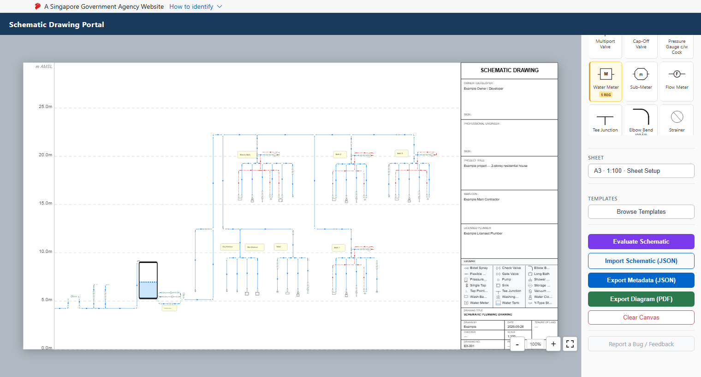
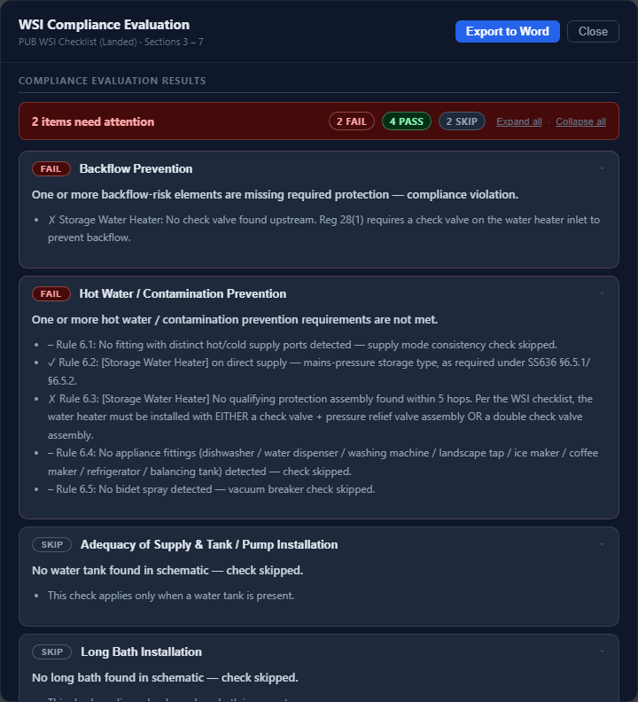
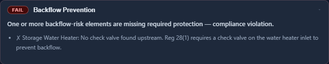
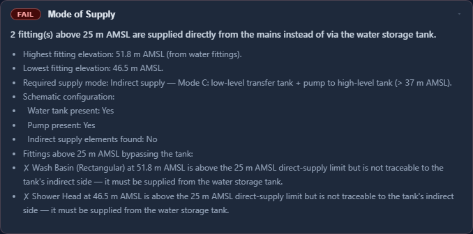
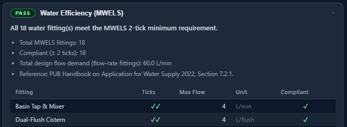

# Schematic Drawing Portal

A web application for drawing water pipe schematics and running deterministic compliance evaluations against Singapore's PUB Water Supply (Internal) requirements — SS 636, Regulation 28, and the PUB Handbook 2022.



---

## What it does

**Draw:** Design water pipe schematics on a real-world elevation (m AMSL) canvas using drag-and-drop symbols, on a proper CAD-style sheet (paper size, drawing scale, title block). Export structured JSON metadata or a vector PDF diagram.

**Evaluate:** Run the live canvas through 8 deterministic compliance checks covering backflow prevention, supply mode, water efficiency, tank/pump installation, long baths, hot water contamination, pipe materials, and the highest direct-supply fitting. Export a Word (.docx) report listing every non-compliant item with a cropped image of its location.

There is **no LLM/AI layer** anywhere in this codebase — every check is a rule-based graph/BFS traversal over the schematic's topology, written in plain Python.

---

## Key Features

| Feature | Description |
|---|---|
| Drawing canvas | Drag-and-drop schematic editor with 64 water system symbols, snapping pipe/port connectivity, undo/redo, copy-paste, rubber-band multi-select, rotate/flip, free-text annotations |
| Real-world elevation (m AMSL) | Y-axis maps to metres Above Mean Sea Level. The lower bound is user-set; the upper bound is derived from paper size × drawing scale. Optional labelled Floor Level (FFL) reference lines |
| Sheet & title block | Paper size (ISO A0–A4, ANSI A–E) and drawing scale (1:20–1:500), an editable title block with owner, PE and LP stamp/signature images |
| PE / LP submissions | Title block asks for a submission type (PE or LP) and marks that type's mandatory fields; PDF export is blocked until they are filled — see [Title Block & Submission Type](#title-block--submission-type) |
| 8 compliance checks | Reg 28 backflow, mode of supply, MWELS water efficiency, tank/pump installation, long bath, hot water contamination, pipe materials, highest direct-supply fitting — see [Compliance Checks](#compliance-checks) |
| Live warnings on canvas | Warning badges on symbols missing required backflow protection; prompts to auto-insert double check valve / bidet assemblies |
| Pipe styling | Per-type and per-pipe colour, hot pipes always dashed, AutoCAD-style crossing "jump" arcs, freeform diameter labels (e.g. "20mm") |
| Templates | Pre-built schematics (2-storey residential, 2x pump manifold with/without bypass), placed wherever you click |
| Import / export | JSON metadata export and re-import, vector PDF diagram, Word (.docx) non-compliance report with cropped element images |
| Government masthead | Official Singapore Government Design System (SGDS) "A Singapore Government Agency Website" banner |

---

## Screenshots

### Drawing Canvas


### Compliance Evaluation Report


### REG28 — Backflow Prevention


### SEC221 — Mode of Supply


### SEC721 — Water Efficiency (MWELS)


### Highest Direct Supply Fitting Marker


---

## Quick Start (local development)

### Prerequisites
- Node.js 20+ and npm
- Python 3.12

### 1. Clone the repo

```bash
git clone https://github.com/jh-sudo/drawing-portal.git
cd drawing-portal
```

### 2. Install dependencies

```bash
cd frontend && npm install && cd ..
cd backend && python -m venv .venv
source .venv/Scripts/activate   # Windows (Git Bash); use .venv/bin/activate on macOS/Linux
pip install -r requirements.txt
cd ..
```

Install frontend packages from inside `frontend/` — running `npm install <pkg>` from the repo root creates a stray root `package.json` that the app can't see.

### 3. Run both dev servers

```bash
./start.sh
# Backend:  http://localhost:8000  (logs: backend.log, Swagger docs at /docs)
# Frontend: http://localhost:5173  (logs: frontend.log)
./stop.sh   # when done
```

The Vite dev server proxies `/api/*` to the backend (`frontend/vite.config.ts`), so no environment variables are needed locally.

`start.sh` runs uvicorn **without** `--reload` by default: in a OneDrive-synced folder, OneDrive's background file-touching makes the reload watcher spawn duplicate worker processes that keep serving stale code. After a backend change, run `./stop.sh && ./start.sh`. Set `BACKEND_RELOAD=1` to opt back into `--reload` if the repo isn't in a synced folder.

### 4. Run the tests

```bash
cd backend && source .venv/Scripts/activate
python -m pytest tests/ -q
```

The backend has a pytest suite, one file per compliance check plus the evaluate/export routers. The frontend has no unit-test runner; `npm run build` in `frontend/` is the type/bundle check.

---

## Environment Variables

### Backend (`backend/.env`, optional — gitignored)

| Variable | Default | Description |
|---|---|---|
| `SLACK_FEEDBACK_WEBHOOK_URL` | *(unset)* | Slack Incoming Webhook that receives early-tester feedback. Feedback is always printed to stdout as well. |
| `SYMBOLS_PATH` | `<backend>/symbols` | Path to the symbols directory (SVG library + `manifest.json`) |

Neither needs to be set for local development.

### Frontend (build-time)

| Variable | Default | Description |
|---|---|---|
| `VITE_API_BASE_URL` | *(unset — uses the Vite dev proxy)* | Backend API base URL for **production builds only**, read from `frontend/.env.production`. Don't set it in dev — it bypasses (and can mask problems with) the dev proxy. |

---

## Drawing

### Sheet & Elevation
- **Sheet Setup** (right panel) sets the paper size and drawing scale. The canvas's upper m AMSL bound is derived from them (`paper height × drawing scale`), not set directly.
- **Lower elevation** is user-set (minimum 0 m AMSL).
- **Floor Levels (FFL)** add named reference lines (e.g. "1ST STOREY") at a given elevation, drawn separately from the dashed m AMSL grid.

### Title Block & Submission Type
Open **Sheet Setup → Title Block** (or click the title block on the canvas). Choose a **Submission Type** first — it starts blank on purpose and decides which fields are mandatory:

| Field | PE submission | LP submission |
|---|---|---|
| Professional Engineer | Required | Optional |
| PE Stamp & Signature | Required | Optional |
| Project Title | Required | Required |
| Main Contractor | Required | Required |
| Licensed Plumber | Optional | Required |
| LP Stamp & Signature | Optional | Required |

Required fields are marked with a red asterisk. **Export Diagram (PDF)** is blocked until the submission type and every required field are filled; it lists what's missing and reopens the Title Block tab. The LP stamp is placed on the drawing itself and can be dragged and resized. The rules live in `frontend/src/utils/titleBlockRequirements.ts`.

### Placing Symbols
- Drag a symbol from the palette onto the canvas, or tap/click it and then tap the canvas.
- Click a placed symbol to select it; drag to move. Right-click a multi-selection to mirror it.
- Flip-only symbols (pump, water tank, water heaters, water meter, tap point) ask for a Left→Right / Left←Right orientation on placement.
- Tee junctions and elbow bends ask which port is the inlet.

### Drawing Pipes
1. Click **Cold Water Pipe** or **Hot Water Pipe** in the palette.
2. Click the start point, then the end point (horizontal/vertical only).
3. Pipes chain automatically; press **Escape** to exit pipe mode.
4. Select a pipe to set its colour or a diameter label (e.g. "20mm"). Hot pipes always render dashed; cold pipes solid.

### Annotations & Templates
- Right-click an empty spot on the canvas to add a text annotation (preset notes such as "Normally closed", or your own text, with a font size). Double-click an annotation to edit it.
- **Browse Templates** → **Insert Template**, then click the canvas to place it.

### Import & Export
- **Import Schematic (JSON)** loads a previously exported file, including its title block and sheet setup.
- **Export Metadata (JSON)** exports the full schematic — see [Metadata Export Format](#metadata-export-format). It first shows a short feedback form (early-tester programme); add `?skipFeedback=1` to the URL once to skip it in your browser. Unconnected ports trigger a warning with an **Export Anyway** option.
- **Export Diagram (PDF)** exports a vector PDF of the sheet, including the title block, legend, stamps and diameter labels.
- **Clear Canvas** removes everything, optionally resetting the title block too.

---

## Compliance Evaluation

### How to use
1. Draw your schematic.
2. Click **Evaluate Schematic**.
3. Complete the acknowledgment checklist. Only items relevant to your schematic are shown; the materials, pump-discharge and tank-position items must be ticked, while the appliance and bidet items are optional because the engine verifies those assemblies itself.
4. Review the report, or click **Export to Word** for a `.docx` listing every FAIL/WARN item with a cropped image of its location.

Evaluation runs on the live canvas — there's no separate export/attach step.

### Compliance Checks

| Check | Reference | What it verifies |
|---|---|---|
| Backflow Prevention (REG28) | Reg 28(1), SS 636 §6.4/6.5 | Every backflow-risk element (water heater, bidet, listed appliances) has a check valve / vacuum breaker upstream, found via BFS topology search |
| Mode of Supply (SEC221) | Handbook 2.2.1 | Supply mode matches the highest fitting's elevation: ≤25 m direct, ≤37 m indirect (tank), >37 m Mode C (transfer tank + pump) |
| Water Efficiency (SEC721 / MWELS) | Handbook 7.2.1 | Every water fitting with an MWELS table carries a declared tick rating meeting the minimum (an undeclared rating fails, same as one below the minimum) |
| Tank & Pump Installation | SS 636 | Overflow/warning/outlet dimensions, effective capacity vs. occupancy demand, declared pump head (≤35 m), bypass line topology |
| Long Bath | SS 636 | Capacity ≤250 L needs no provisions; >250 L requires an acknowledgment (TMV, recirculation, 40 mm overflow) |
| Hot Water / Contamination | SS 636 §6 | Direct-supply heater type, heater backflow protection (check valve + PRV, or double check valve), appliance double check valves, bidet vacuum breaker + check valve order, hot/cold supply-mode consistency per fitting |
| Pipes & Fittings — Materials | SS 636 §7 | LP/PE acknowledgment that all pipes/fittings comply with SS 636 Table 1 |
| Highest Direct Supply Fitting | Supports SEC221 | When any fitting is (or may be) on direct supply, requires exactly one "Highest Direct Supply Fitting" marker with a declared elevation, so a reviewer can read it off the drawing. It doesn't validate the elevation against SEC221's threshold itself. |

All 8 checks share one adjacency graph built per evaluation (`build_adjacency`) and a shared backflow-assembly BFS helper. Full hydraulic network calculations are intentionally out of scope; the only hydraulic rule is the declared pump head limit.

---

## Project Structure

```
drawing-portal/
├── start.sh / stop.sh                # Local dev scripts
├── docker-compose.yml                # Self-hosted production-style stack
├── docker-compose.override.yml       # Dev overrides (auto-applied by `docker compose up`)
├── scripts/export_slack_feedback.py  # Pulls tester feedback from Slack into a CSV
│
├── backend/
│   ├── Dockerfile / Dockerfile.dev
│   ├── airbase.json                  # Airbase deployment config (soar/sdp-be, port 8000)
│   ├── requirements.txt
│   ├── app/
│   │   ├── main.py                   # FastAPI app — health, symbols, evaluate, feedback, export routers
│   │   ├── config.py                 # Settings (pydantic-settings, reads backend/.env)
│   │   ├── agents/                   # Compliance checks (deterministic, no LLM)
│   │   │   ├── compliance_checks.py      # REG28 (backflow), SEC221 (supply mode), SEC721 (MWELS)
│   │   │   ├── hot_water_contamination_check.py
│   │   │   ├── tank_pump_check.py
│   │   │   ├── long_bath_check.py
│   │   │   ├── section3_pipe_check.py
│   │   │   ├── highest_fitting_check.py
│   │   │   ├── backflow_assembly.py      # Shared BFS/assembly-order helper
│   │   │   └── graph_utils.py            # Shared adjacency-graph builder
│   │   ├── routers/                  # health, symbols, evaluate, feedback, export
│   │   ├── models/, schemas/         # Pydantic models for the symbol manifest
│   │   └── services/                 # image_annotator, symbol_service, upload_limits
│   ├── symbols/
│   │   ├── default/                  # SVG symbol files
│   │   └── manifest.json             # Symbol registry (id → name/category/filename)
│   └── tests/                        # pytest — one file per compliance check + routers
│
├── frontend/
│   ├── Dockerfile / Dockerfile.dev
│   ├── airbase.json                  # Airbase deployment config (soar/spd-fe-2, port 3000)
│   ├── package.json / vite.config.ts
│   └── src/
│       ├── main.tsx                  # Entry point (also registers the SGDS masthead)
│       ├── components/
│       │   ├── canvas/               # DrawingCanvas, ElementsLayer, GridLayer, TitleBlockLayer, LpStampLayer, dialogs
│       │   ├── panel/                # SymbolPalette, ActionPanel, MrlConfigPanel, PipeColorPanel, PipeDiameterPanel
│       │   ├── common/               # SheetSetupModal, AcknowledgmentModal, EvaluationModal, TemplateModal, FeedbackModal
│       │   ├── chat/                 # Compliance-report display (EvaluationReport, ComplianceCheckCard, WelsTable) — no chat UI
│       │   └── layout/               # AppLayout (masthead + header), CanvasPane, ControlPane
│       ├── store/                    # Zustand: canvasStore (elements/pipes/annotations/undo), uiStore (tool/sheet/title block/MRL)
│       ├── utils/                    # metadataBuilder, pdfVectorExport, titleBlockRequirements, symbolPorts, pipeJumps, …
│       ├── hooks/                    # useCanvasInteraction, useMetadataExport, useJsonImport, useSymbols
│       ├── data/templates.ts         # Built-in templates
│       └── types/index.ts            # Shared types
│
├── .claude/skills/run-schematic-drawing-portal/  # Playwright driver + regression scripts (local only, not committed)
│
└── docs/
    ├── screenshots/
    └── examples/                     # Real JSON exports of the built-in templates
```

---

## Metadata Export Format

Abridged from [docs/examples/template_2_storey_residential.json](docs/examples/template_2_storey_residential.json):

```json
{
  "schema_version": "1.0",
  "exported_at": "2026-09-28T03:07:29.102Z",
  "title_block": {
    "submissionType": "LP",
    "projectName": "Example project — 2-storey residential house",
    "mainContractor": "Example Main Contractor",
    "licensedPlumber": "Example Licensed Plumber",
    "drawingNo": "EX-001", "date": "2026-09-28", "rev": "-"
  },
  "mrl_config": { "upper_mrl": 29.7, "lower_mrl": 0, "unit": "m AMSL", "range": 29.7 },
  "canvas": { "width_px": 1104, "height_px": 594 },
  "sheet_config": { "paper_size": "A3", "drawing_scale": 100 },
  "materials_acknowledged": false,
  "pump_discharge_material_acknowledged": false,
  "appliance_check_valve_acknowledged": false,
  "bidet_vacuum_breaker_acknowledged": false,
  "tank_position_acknowledged": false,
  "elements": [
    {
      "id": "044c5997-…",
      "type": "symbol",
      "symbol_id": "wash_basin_rectangular",
      "symbol_name": "Wash Basin (Rectangular)",
      "node_type": "water_fitting",
      "position": { "canvas_x": 448.11, "canvas_y": 284.33 },
      "elevation_m": 15.48,
      "supply_mode": "indirect_supply",
      "rotation_deg": 0,
      "scale_x": 1,
      "fitting_type": "basin_tap",
      "efficiency_rating": 2,
      "ports": [
        { "index": 0, "role": "upstream", "label": "Hot", "mrl": { "value": 15.73, "unit": "m AMSL" },
          "connects_to_element_id": "6fe714f3-…", "connects_to_port_index": 1, "supply_mode": "indirect_supply" }
      ]
    }
  ],
  "pipes": [
    {
      "id": "859f02e5-…",
      "type": "water_pipe",
      "pipe_type": "cold",
      "start": { "canvas_x": 65.9, "canvas_y": 509.33, "mrl": 4.23 },
      "end": { "canvas_x": 87.22, "canvas_y": 509.27, "mrl": 4.24 },
      "end_connects_to": "f2d4b057-…",
      "flow_to_element_id": "f2d4b057-…",
      "length_px": 21.32
    }
  ],
  "annotations": [
    { "id": "8214f612-…", "type": "annotation", "text": "Normally closed",
      "position": { "canvas_x": 290.93, "canvas_y": 507.25 }, "mrl": { "value": 4.34, "unit": "m AMSL" },
      "font_size": 2, "color": "#1a1a1a", "max_width": 22, "height": 2.7 }
  ],
  "hydraulic_context": { "flow_mode": "pump_assisted", "pump_element_ids": ["…", "…"], "note": "…" },
  "summary": { "total_elements": 226, "total_pipes": 132, "total_pipe_length_px": 4755.56 }
}
```

Types for every field are in `frontend/src/types/index.ts` (`DrawingMetadata`). Any field added to an element, pipe or annotation must be wired into both `metadataBuilder.ts` (export) and `useJsonImport.ts`'s `parseSchematic()` (import), or it silently fails to round-trip — historically the most common bug class in this codebase.

---

## Deployment

### Production (Airbase)
Both services deploy to Airbase as containers, configured by `backend/airbase.json` (`soar/sdp-be`, port 8000) and `frontend/airbase.json` (`soar/spd-fe-2`, port 3000).

- **Backend:** `backend/Dockerfile` optionally bakes `backend/.env` (gitignored) into the image, since Airbase has no runtime secrets UI. Create it locally before deploying if you need the Slack webhook.
- **Frontend:** `frontend/Dockerfile` serves a **prebuilt** `dist/` folder, so run `npm run build` in `frontend/` before deploying. The API URL is baked in at build time from `frontend/.env.production`.

### Docker Compose (self-hosted)

`docker compose up --build` automatically applies `docker-compose.override.yml`, which runs both services in **dev mode** (backend with `--reload` on :8000, Vite on :5173).

For the production-style images only:

```bash
cd frontend && npm run build && cd ..
docker compose -f docker-compose.yml up --build
# Backend:  http://localhost:8000
# Frontend: http://localhost:3000
```

Both modes expect a `backend/.env` file to exist (it can be empty).

---

## Tech Stack

| Layer | Technology |
|---|---|
| Frontend | React 18, TypeScript, Vite, react-konva (Konva.js canvas), Zustand, Axios |
| Design system | SGDS web components (`@govtechsg/sgds-web-component`) — masthead only |
| PDF | jsPDF + svg2pdf.js (vector diagram export) |
| Backend | Python 3.12, FastAPI, Uvicorn, pydantic-settings |
| Compliance engine | Deterministic Python — BFS/graph traversal over schematic topology, no LLM |
| Document export | python-docx (Word report), Pillow (annotated images) |
| Containerisation | Docker / Docker Compose, Airbase |

---

## Contributing

Pull requests are welcome. For major changes, open an issue first to discuss what you'd like to change.

---

## License

MIT — see [LICENSE](LICENSE).
